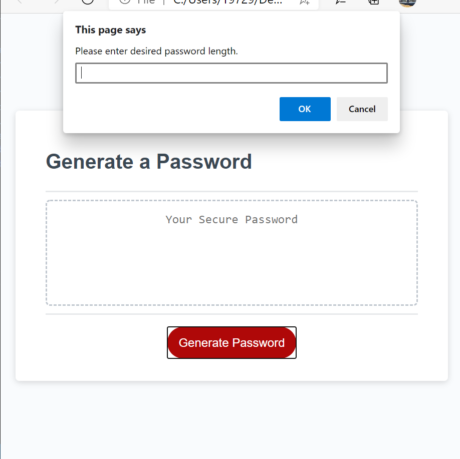

# Password-Generator, JavaScript Homework:
This application generates a random password based on input from choices prompted to the user. These prompts help guide the user on the parameters regarding the criteria needed to generate a random password. User will be alerted if their input does not meet minimum criteria. Password generated will directly correlate with the user's input from the prompts.

https://mpapamichalis.github.io/Password-Generator/

